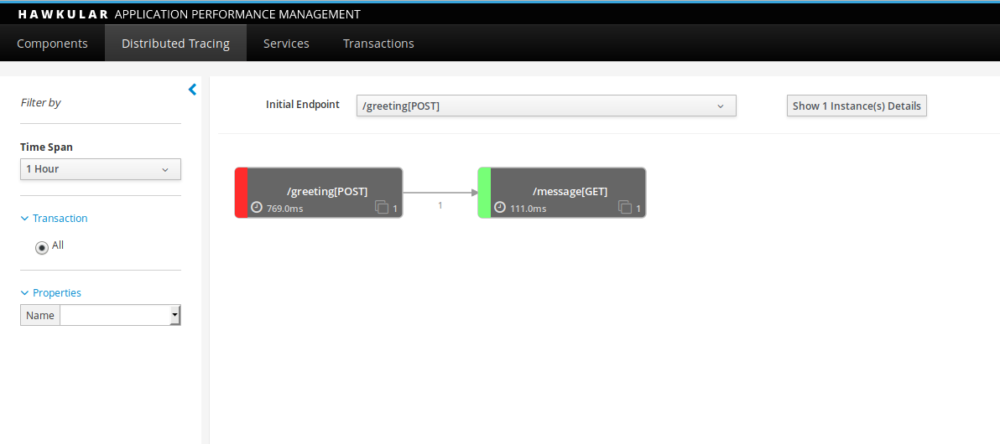
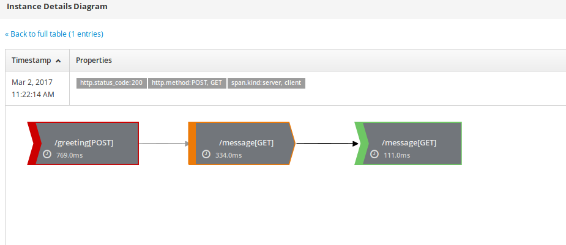

# Spring Boot Example using OpenTracing Java Agent with Hawkular APM

This example demonstrates how to instrument a Spring Boot application in a non-intrusive way, using the
OpenTracing Java Agent with Hawkular APM as the backend tracing system.

## The Example

The example has two Spring Boot services. The first service (Service A) is called by an external client (e.g. curl) using the `/greeting` endpoint, supplying an optional `name` parameter. This service then calls Service B to obtain the message template to be used. Finally the template, with the optional supplied `name` parameter is used to return a message to the client.

Before being able to run the example with the OpenTracing Java Agent, it will be necessary to [startup a Hawkular APM server](https://hawkular.gitbooks.io/hawkular-apm-user-guide/content/quickstart/):

```
docker run -p 8180:8080 jboss/hawkular-apm-server-dev
```

For this example, we will run the Hawkular APM server on port 8180, and the example services on port 8080 and 8090 respectively.

Create a separate command window for each service, and run the following commands from the service's sub-folder:

```
export HAWKULAR_APM_USERNAME=jdoe
export HAWKULAR_APM_PASSWORD=password
export HAWKULAR_APM_URI=http://localhost:8180

mvn clean install

mvn spring-boot:run -Drun.jvmArguments=-javaagent:target/lib/opentracing-agent.jar

OR

java -javaagent:target/lib/opentracing-agent.jar -jar target/servicea-1.0.0-SNAPSHOT.jar

(change 'servicea' to 'serviceb' as appropriate)
```

The second way of invoking the service uses the uber jar created during the maven build.

Then run the client:

```
curl http://localhost:8080/greeting -d name=Fred
```

The response from this command should be:

```json
{"id":1,"content":"Hello, Fred!"}
```

Finally, start up the [Hawkular APM](http://localhost:8180) UI, login with the username `jdoe` and password `password` and you should see the interactions between the two services on the Distributed Tracing page.



Selecting the _Show 'n' instance(s) details_ button will also show the individual trace instance.




## How It Works

This section describes how to take a standard Spring Boot application and prepare it for instrumentation
using the OpenTracing Java Agent.

### Obtain the OpenTracing Java Agent

This can be done manually, and stored in an appropriate location to be accessed when invoking the service. However for simplicity we have included retrieving the agent as part of the example build:

```xml
    <dependency>
      <groupId>io.opentracing.contrib</groupId>
      <artifactId>opentracing-agent</artifactId>
      <scope>provided</scope>
      <version>...</version>
    </dependency>

...

      <plugin>
        <groupId>org.apache.maven.plugins</groupId>
        <artifactId>maven-dependency-plugin</artifactId>
        <executions>
          <execution>
            <id>get-agent</id>
            <phase>compile</phase>
            <goals>
              <goal>copy</goal>
            </goals>
            <configuration>
              <artifactItems>
                <artifactItem>
                  <groupId>io.opentracing.contrib</groupId>
                  <artifactId>opentracing-agent</artifactId>
                  <overWrite>true</overWrite>
                  <outputDirectory>${opentracing-agent.lib}</outputDirectory>
                  <destFileName>opentracing-agent.jar</destFileName>
                </artifactItem>
              </artifactItems>
            </configuration>
          </execution>
        </executions>
      </plugin>
```

### Instrument the technologies and frameworks

The OpenTracing framework integrations and rules are added to the services as dependencies, e.g.

```xml
    <!-- OpenTracing Java Agent rule dependencies -->
    <dependency>
      <groupId>io.opentracing.contrib</groupId>
      <artifactId>opentracing-agent-rules-java-net</artifactId>
      <version>...</version>
    </dependency>
    <dependency>
      <groupId>io.opentracing.contrib</groupId>
      <artifactId>opentracing-agent-rules-java-web-servlet-filter</artifactId>
      <version>...</version>
    </dependency>

    <!-- OpenTracing Framework Integration dependencies -->
    <dependency>
      <groupId>io.opentracing.contrib</groupId>
      <artifactId>opentracing-web-servlet-filter</artifactId>
      <version>...</version>
    </dependency>
```

In these example services, we will use the
[servlet integration](https://github.com/opentracing-contrib/java-web-servlet-filter) and the direct
instrumentation rules for the Java `HttpURLConnection`.

NOTE: Currently the agent instrumentation rules for installing the servlet filter are provided as a
separate maven dependency. Eventually these rules will be bundled with the servlet integration project.

### Add an OpenTracing Compliant Tracer

This example has currently been configured to use the Hawkular APM OpenTracing compliant Tracer:

```xml
    <!-- OpenTracing compliant Tracer dependencies -->
    <dependency>
      <groupId>org.hawkular.apm</groupId>
      <artifactId>hawkular-apm-client-opentracing</artifactId>
      <version>...</version>
    </dependency>
    <dependency>
      <groupId>org.hawkular.apm</groupId>
      <artifactId>hawkular-apm-trace-publisher-rest-client</artifactId>
      <version>...</version>
    </dependency>
```

However any suitable `Tracer` implementation can be used, as long as it can be located using the
[Global Tracer](https://github.com/opentracing-contrib/java-globaltracer) utility.

Use of Hawkular APM's Tracer also requires a custom ByteMan rule to be used as a temporary measure,
to prevent the trace information being reported to the APM server being instrument itself. The `Tracer`
uses Java's `HttpURLConnection` to report the information to the server, and therefore must instruct the
agent to ignore these communications. This is achieved using the rule defined in the service's
`src/main/resources/otagent/hawkular-apm.btm` file, with content:

```
RULE Hawkular APM Ignore server communications
CLASS java.net.URL
METHOD openConnection
HELPER io.opentracing.contrib.agent.OpenTracingHelper
AT EXIT
IF $0.getPath().startsWith("/hawkular/apm")
DO
  $!.setRequestProperty("opentracing.ignore","true");
ENDRULE
```

NOTE: Once the OpenTracing Agent has been released, the Hawkular APM project will be updated to mark the
`HttpURLConnection` directly with this request property.


